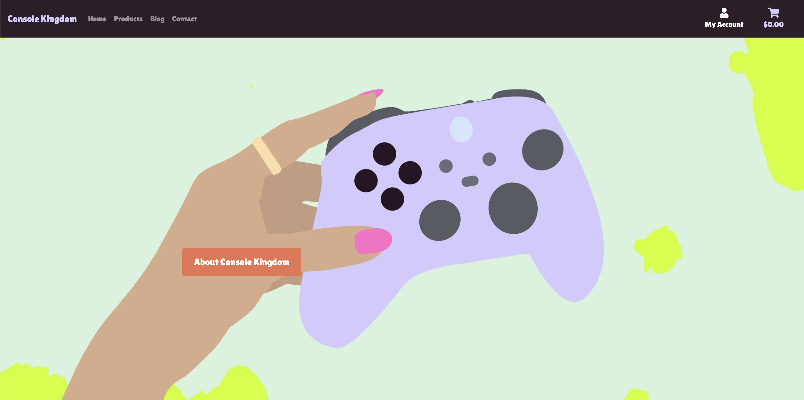

# Console Kingdom

## Introduction

Console Kingdom is a fictional B2C e-commerce store that is designed and implemented with Python and Django, HTML, CSS and some Javascript. It specialises in selling gaming products to consumers online.

Link to deployed site can be found [Here](https://console-kingdom-1-e73d5794a126.herokuapp.com/)

## Responsive Design

  <h2>Responsive UI:</h2> I talk about thiis in my bug section of my readmefile

  
  
  

### Strategy
* Console Kingdom is a B2C type of business. In recent times online shopping has becom e the more preffered choice of pursching goods. Console Kingdom aims to offer flexible online shopping to its customers.

# UX
## User stories
## As Admin
* As a admin I can manage users' accounts so that I can make any required changes to them if needed
* As a admin I can manage products so that I can add, update or delete products when necessary
* As a admin I can view created orders so that I can full fill the orders or amend if needed
* As an admin I can manage the newsletter signees

## As a site user
* As a site user I can create or edit my account so that I can update my details accordingly
* As a site user I can login in my account so that I can view my order history
* As a site user I can shop for products
* As a site user I can browse through products so that I can decide what I may be interested in buying
* As a site user I can look at product details so that I can decide if I want to purchase it
* As a site user I can easily add products I want to purchase to a cart so that I can decide whether to purchase or not
* As a site user I can view the contents of my shopping basket so that I can be able to make any adjustments
* As a site user I can update my bag by adding more or remove products so that I can decide on the number of products I intend to buy
* As a site user I can view my order summary so that I can verify it before confirming
* As a site user I can checkout securely so that I can I maintain the level of trust on the site
* As a site user I can use the contact details in the footer to contact the site owners
* As a site user I can sign up to newsletter

## Architecture

## Database

  
Click here to view Database Schema:

  

## Design
Before I wrote any code for this site, I had to pin point a simple design of what I wanted my site to look like by using wireframes.

  
Click here to view Wireframes:

  
  
  
  
 
  

## E-commerce type

Console Kingdom is an online store that sells directly to customers. The functionality on this site for a regular customer is ability to make a purchase swiflty and quickly. For the owners, the goal is to archieve CRUD functionality.

## Marketing
Though there are a lot of marketing techniques for businesses, Console Kingdom decided to first use, facebook to drive out content and engage with customers. Visit our facebook page [here](https://www.facebook.com/Console-Kingdom-115364421628176). 

# Features
## Homepage

To start off, clicking the Console Kingdom url takes you to the home page with a logo on the left, my account and shopping bag to the right, followed by a navigation menu and footer. All these appear on every page on the site. Also found on home page is a hero image accompanied by a modal that describes what the business is about.

### Navbar

### Home Page

### Register/Sign up

On the right side of the home page, for the first time user they will need to register their account to enjoy most of the site benefits such as saving their order details. When registering users are asked their username, email and password.

### Sign In

Registered users would need to sign in when they visit the site again. They will be asked to enter their username and password. The Remember me option is also available making life easier for returning users. Is users need to reset their password, a forgot password is also available.

### Logout
Users are able to leave their account by logging out of the site.

## All Products

The first navigation link from the logo is all products. This is where you can display all products available.

 
 ### Product Detail and Add to Cart

 Each product on site has a detailed information in form of a name, price,image, description. The user is displayed with a quantity input box to select the quantity they need to add to the shopping bag either increasing or decreasing. They have an option to go back to products by clicking the keep shopping button. Each time a user add a product to the bag they get a notification that alert them of that action.

 

 

 ### The Shopping Bag

 Consists of the price, quantity of each item and sub total. User has an option to update their bag and or remove some items from bag. They can easily go back to products by clicking keep shopping or go to checkout.

### Checkout

On the left side of the checkout is where user puts their information, and on the right side is a summary of their order that is the total, the delivery.

### Checkout Success

After completing an order, users receive an order confirmation with their details including order number.

### Product Detail- Super User

If the user is the super user, they have an option to either delete or edit their product

### Add Product

Only super users are authorized to add products to products catalogue

### Edit Product

Super users only can edit the product by editing either name, description, price and update image. 

### Delete Product

Super users only can as well delete the products from the site

# Footer

The footer appears on all pages of the site, it contains the newsletter sign up, about us, and social links

## About Us Modal

About us modal describes in brief what the site is all about to the users.

# My Account

The my account page displays a user's saved contact infomation and their order history

# 404 page

A 404 page is also available to handle navigation errors with a home link button to take them back to the home page

### Future features

* Product rating by users

# Web marketing

## Email marketing

Each user that signs up is added to the newsletter list.

## Search engine optimization

SEO keywords

## Social media marketing

A facebook page was created to build community from the target market. Facebook is free and it also takes little to no time to set up and also it has so many users whom a business can strive to maintain a certain relationship, create content and connect with a target audience.

## Technologies

### Languages

* [HTML](https://developer.mozilla.org/en-US/docs/Web/HTML)

* [CSS](https://developer.mozilla.org/en-US/docs/Web/CSS)

* [Javascript](https://www.javascript.com/)

* [Python](https://www.python.org/)

### Frameworks, programs and libraries used

* [Django](https://www.djangoproject.com/) - Django is a high-level Python web framework that encourages rapid development and clean, pragmatic design.

* [Bootstrap4](https://getbootstrap.com/) - A css framework

* [Gitpod](https://www.gitpod.io/) - Gitpod was used as an IDE

* [Github](https://github.com/) - I used Github to store all the data of my project after pushing it

* [Heroku](https://www.heroku.com/) - is a cloud platform service  I used to deploy and host the project

* [ElephantSQL](https://www.elephantsql.com/) - used as a database for the project

* [Font Awesome](https://fontawesome.com/) - Was used to add icons for my social media links.

* [PEP8ci](https://pep8ci.herokuapp.com/) - I used it to validate python code

* [Stripe](https://stripe.com/en-ie) - was used for checkout functionality and facilitate online payments

* [AWS](https://aws.amazon.com/s3/) - for  object storage through a web service interface.

# Testing

## Manual Testing

 | Feature | Test  | Expected Result | Actual Result |
| -------------| ----- | ----- | :----: |
| Console Kingdom  | Selecting logo on homepage |  directs user back to homepage |  Pass |
| Navigation Links  | Selecting navigation links |  directs user to relevant pages |  Pass |
| Products Page  | Selecting products |  directs user to products |  Pass |
| Back to Top | Back to top button | Select the button on the products page brings the user back to the top of the page  |  Pass |
| About Us Button | Selecting About Us |  opens the about us modal |  Pass |
| Sign up for our newsletter | selecting Sign up for our newsletter |  notifies user is signed up to newsletter |  Pass |
| Privacy policy | Selecting privacy policy |  directs user to privacy policy|  Pass |
| Facebook icon | Selecting  facebook icon |  directs user to Console Kingdom facebook page |  Pass |
| Contact | Selecting Contact | directs user to contact section in the footer  |  Pass |
| My account | Selecting my account as admin | displays dropdown menu unique to admin apart from account and logout  |  Pass |
| Add product | Adding a new product| successfully add new product to products page  |  Pass |
| Add Product | no image is selected | default image is used |  Pass |
| As Admin edit product | editing product |  successfully edited the product |  Pass |
| As Admin Delete product | Deleting product|  successfully remove product |  Pass |
| Register | Register for an account | selecting Register in my account directs user signup page |  Pass |
| Register | Registering as a new user | Registering as a new user form works |  Pass |
| Login | Login to an account | selecting Login in my account directs user to Login page |  Pass |
| Login | Login to an account | login-in as a new user form works |  Pass |
| Login as admin| Login to as admin gives access to product management functionality | login-in as a new user form works |  Pass |
| Logout | message shown | Logging out message shown |  Pass |

## User story testing

### User + Admin

* As a site user I can login and out of my account so that I can update my details accordingly or view my order history
   > As a user I can get all the information about the website from the landing page 
* As a site user I can login and out of my account so that I can update my details accordingly or view my order history
> As a user I can see the landing page with information displayed on it so that I can understand what site I'm using
* As a site user I can view all ther prodcuts on sale on the website
> As a user I can view products on website so that I can make informed decisions
* As a super user I can add/edit/delete prodcust from the website with no confusion
> As a admin I can add/edit/remove products on the website so that users have a selection of products to choose from
* As a site user I recieve feeback on all actions made on the website so I'm aware of my actions
> As a user I receive feedback about my actions
* As a site user I can create a profile to see my order history and edit my user details
> As a user I can create a user profile so that I can access unrestricted content on the website
* As a super user I can add new prodcust through the create a prodcut page or through the admin site
> As a admin I can add new products for sale
* As a super user I can edit current prodcuts details that are listed on the website product page
> As a admin I can edit current products in the database
* As a super user I can delete current prodcuts that are listed on the website product page
> As a admin I can delete products in the database so that they no longer appear on the website to the user
* As a user I can register for an a account
> As a user I can create and account
* As a user I can edit my details in the my account page
> AAs a user I can edit my account details
* As a user I can acces the navbar content from anywhere on the site 
> As a user I can access the navbar so that I can navigate the site smoothly
* As a user I can log out of my account when I choose if I n o longer want my account to be signed in 
> As a user I can log in and out as I choose
* As a user I know I'm logged in because on the account section I have the option to logout or view profile also the user feedback is provided when I sign in
> As a user I can clearly see when I'm logged in
* As a user by licking on the cart button I can clearly see what and how many of a product is in my cart along with all the prices including the total
> As a user I can view my shopping cart
* As a user I can add what I desire into my cart and my bag is previwed when processed
> As a user I can add items to my cart
* As a user I can remove what I desire from my cart by clicking the remove product button
> As a user I can remove selected items from my cart so that I only buy the items I want
* As a user the footer provides a newsletter signup section, a contact section and a socials link with my facebook business page attached
> As a user I can access the footer so that I can find relevant links and information about business
* As a user using the default stripe credit card info I can purchase my cart 
> As a user I can pay for items in my cart
* As a user after buying a product I'm notified the order is completed and presented with the order details page
> As a user I can be notified when my order is completed
* As a user I can edit the quantity of an item within the cart page
> As a user I can edit the quantity of products in my cart so that choose the amount of an item I want
* As a user I can fill in my details in the checkout page before submitting my order
> As a user I can complete my order so that I can purchase my chosen product
* As a user I can register to the newsletter
> As a user I can sign-up to a newsletter

## Functionality testing

Throughout developing this site, I have been using Chrome, and chrome dev tools to help with debugging issues. Testing responsiveness was done using chrome emulated devices.

### Javascript validation

I used JSlint to validate javascript found in some apps

* cart app - use double quotes warning 

* base.html - use double quotes warning 

* checkout app - no warnings

* products app - Use double quotes warning

* users app - 7 use double quotes warnings

### Python

[ CI Python linter ](https://pep8ci.herokuapp.com/) was used to test all my python code. Only warnings displayed now are line is too long.

### HTML and CSS

Formatted all html and css files and removed all commmented out code.

### Lighthouse

Lighthouse was used to test performance, best practices, accessibility and SEO.

## Bugs

For this project there were a few bugs I encountered.

### Bug 1
Toasts not showing/displaying - Having all the code set up properly and checking in chrome dev tools I could see they were rendering in my template however not displaying. To fix this,I had to add a cdn which was not working rgianlly and now all toasts work as intended.

### Bug 2
My deployed app on heroku wqs displayed as 404 error. I had added https:// in the allowed host in my settings.py.

### Bug 3
Another noticeable bug was when the aaplication was in mobile the footer was covering the content. I fixed by adding a custom id and having height set as auto so fucntionalyt could resume.

### Bug 4
My website is deployed and working but I can't load a resposive design UI picture. I did not have time to go back and fix this because I had no time due to unfortunate circumstances realting to health, so did added in a google inspect and attached it under the empty responsive UI screenshot at the start of this readme.

# Deployment

I developed this site on Gitpod, using git for version control. Then deployed to Heroku using the following steps

* Log in to [Heroku](https://id.heroku.com/login) or create an account

* Click New and Create New App

* I selected Europe as region.

* Click Create App button

I then went to create a database to connect to the new created app.

* Login to [ElephantSQL](https://www.elephantsql.com/)

* Create new instance

* Set up your plan - Give the plan a name and select Tiny Turtle free plan

* Select region button

* Select a data center ner your. I selected EU-West-1(Ireland)

* Click Review

* Click Create instance

* Return to elephantsql dashboard, click on database instance name

* In the url section, clicking the copy icon will copy the database url to the clipboard

* Go back to Heroku to your created app, go to Settings

* Add config var DATABASE-URL, and for the value, copy in your databse url from ElephantSQL. do not add quotation marks around your database

* In Gitpod install dj-database_url and psycopg2 to connect to your external database

* Update requirements.txt: pip freeze > requirements

* import dj_database_url in settings and update your database

* migrate your database

* create a new superuser for your database and at this point your database is exposed do not commit it to github

* Install gunicorn and freeze into the requirements file

* Then create Procfile

* DISABLE_COLLECTSTATIC

* Commit and push to github

* On your app in Heroku go to Deploy and connect it to github and search your repository, click connect.

* Choose automatic or manual deploy. I chose manual. Click deploy branch

* When complete click View to open the deployed app

## From Github docs

### Forking 

* Open GitHub page that hosts the repository you wish to fork.
* Find the 'Fork' button at the top right of the page
* Once you click the button the fork will be in your repository

### Cloning

* Open Go to the repository page on Github
* click on the green button that says "Code".
* You can choose to download a zip file of the repository, unpack it on your local machine, and open it in your IDE.
* Copy the URL under the HTTPS tab to clone using https.
* In a new window, and set the current directory to the one you want to contain the clone from.
* Type git clone and paste the URL copied from the GitHub page.
* The repository clone will now be created on your machine. 

## Credits

* Code Institute Botique Ado walk through project

* [Stack overflow](https://stackoverflow.com/)

* [Boostrap](https://getbootstrap.com/docs/4.0/getting-started/introduction/) was used for alot of my stylin

Products description inspiration from:

* [Currys](https://www.currys.ie/)

### Acknowledgement and support

* My Mentor Jubril Akolade

                  
